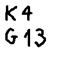
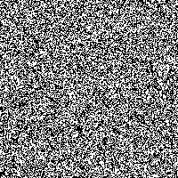
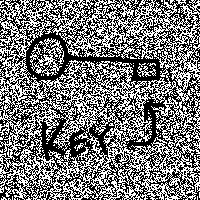

# Kryptografia wizualna 🔑👀

## Teoria
| piksel | prawdopodobieństwo | udział #1 | udział #2 | wynik |
|:---:|:---:|:---:|:---:|:---:|
| ⬜ | p = 0.5 | ⬛ | ⬛ | ⬛ |
| ⬜ | p = 0.5 | ⬜ | ⬜ | ⬜ |
| ⬛ | p = 0.5 | ⬛ | ⬜ | ⬛ |
| ⬛ | p = 0.5 | ⬜ | ⬛ | ⬛ |

## Przykład

|secret.png|share_1.png|share_2.png|secret_decrypted.png|
|:---:|:---:|:---:|:---:|
|  |  |  |  |